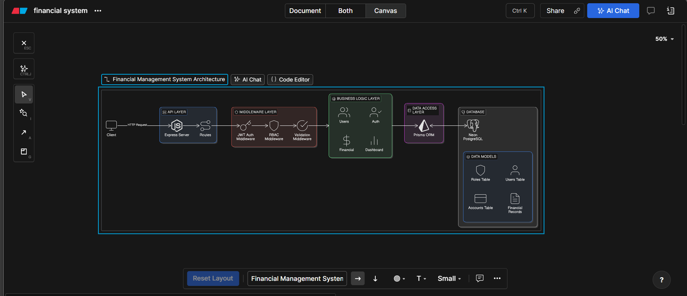
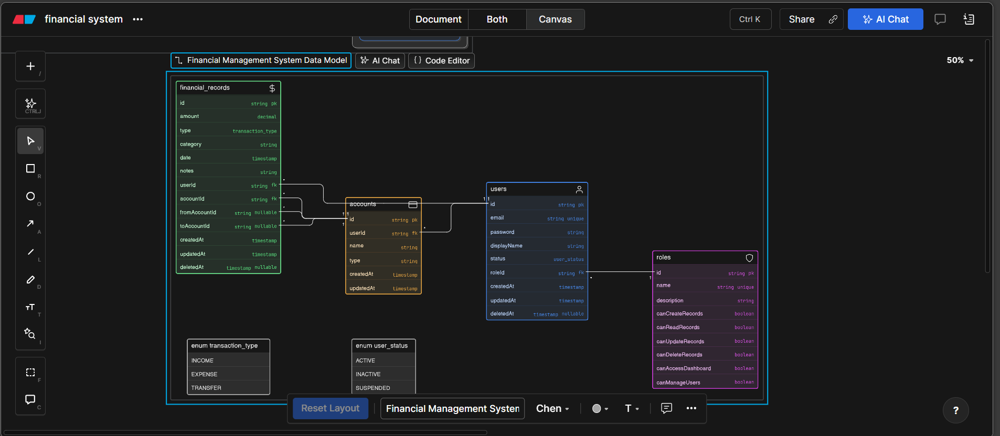

# Financial Management System Backend

## Overview

This project is a backend system for a finance dashboard that manages users, accounts, financial records, and analytics. It demonstrates backend architecture, API design, access control, and data modeling.

The focus is on **clarity, correctness, and real-world backend thinking**, rather than unnecessary complexity.

---

## Tech Stack

* **Node.js + Express.js**
* **TypeScript**
* **PostgreSQL (Neon)**
* **Prisma ORM**
* **JWT Authentication**

---

## Architecture

The system follows a layered architecture:

* **Routes** → API endpoints
* **Middleware** → Authentication + RBAC
* **Controllers** → Business logic
* **Prisma** → Data access
* **Database** → PostgreSQL

---

## System Design

### Architecture Diagram



---

### ER Diagram



---

## Data Model

### Entities

* User
* Role
* Account
* FinancialRecord

### Relationships

* User → Role (many-to-one)
* User → Accounts (one-to-many)
* User → Records (one-to-many)
* Account → Records

---

## Authentication

* JWT-based authentication
* Token passed via:

```
Authorization: Bearer <token>
```

* Middleware verifies token and attaches user

---

## Authorization (RBAC)

### Roles

| Role    | Permissions              |
| ------- | ------------------------ |
| Viewer  | Read records only        |
| Analyst | Read records + Dashboard |
| Admin   | Full access              |

---

### Enforcement

Permissions are enforced using middleware:

```ts
requirePermission("canCreateRecords")
```

---

## Ownership vs RBAC

The system combines:

* **RBAC (role-based access)**
* **Ownership checks (user-specific data)**

### Design

| Feature   | Control          |
| --------- | ---------------- |
| Accounts  | Ownership        |
| Records   | RBAC + Ownership |
| Dashboard | RBAC             |
| User mgmt | Admin only       |

---

## Financial Records

### Types

* INCOME
* EXPENSE
* TRANSFER

---

### Rules

* Income/Expense → require `accountId`
* Transfer → requires `fromAccountId` + `toAccountId`

---

### Transfer Design

* Only allowed between **same user's accounts**
* Does NOT affect total income/expense
* Represents internal movement

---

##  Dashboard APIs

Provides:

* Total income
* Total expenses
* Net balance
* Category breakdown
* Recent activity
* Monthly trends

---

### Access Control

* Viewer →  no access
* Analyst → limited access
* Admin → full access

 Dashboard is **user-specific only**

---

##  Soft Deletion

### What is it?

Instead of deleting data:

```ts
deletedAt = new Date()
```

Records are filtered using:

```ts
deletedAt: null
```

---

### Benefits

* Data recovery
* Audit history
* Prevents accidental loss

---

### Applied to

* Financial Records
* Users

---

##  API Endpoints

### Auth / Users

* POST `/users/register`
* POST `/users/login`
* GET `/users/me`

### Accounts

* POST `/accounts`
* GET `/accounts`
* PATCH `/accounts/:id`
* DELETE `/accounts/:id`

### Records

* POST `/records`
* GET `/records`
* PATCH `/records/:id`
* DELETE `/records/:id`

### Dashboard

* GET `/dashboard/summary`
* GET `/dashboard/categories`
* GET `/dashboard/recent`
* GET `/dashboard/trends`

---

##  API Testing

A Postman collection is included:

```
/docs/financial Management.postman_collection.json
```

### Usage

1. Import into Postman
2. Set base URL:

```
http://localhost:8001/api/v1
```

3. Add JWT token in headers


## Assumptions

* Users manage their own accounts
* Transfers are limited to same user
* Cross-user transfers are not supported
* Dashboard is user-specific
* RBAC strictly follows assignment requirements

---

##  Tradeoffs & Design Decisions

### 1. RBAC vs Real-World Behavior

Real systems allow users to manage their own records, but this implementation follows assignment constraints:

* Only Admin can create/update/delete records

---

### 2. Transfer Simplification

Cross-user transfers are not implemented to avoid complexity.

---

### 3. No External Services

No third-party auth or email used to keep focus on backend fundamentals.

---

### 4. No Refresh Tokens

Simplified authentication for assignment scope.

---

##  Future Improvements

* Refresh tokens
* Email notifications
* Advanced analytics
* Unit tests

---

##  Setup

```bash
npm install
```

```bash
npx prisma migrate dev
```

```bash
npx prisma db seed
```

```bash
npm run dev
```

---

## Conclusion

This project demonstrates:

* Clean backend architecture
* Strong RBAC implementation
* Thoughtful data modeling
* Real-world validation and tradeoffs

The focus was on building a system that is **correct, maintainable, and scalable**.
